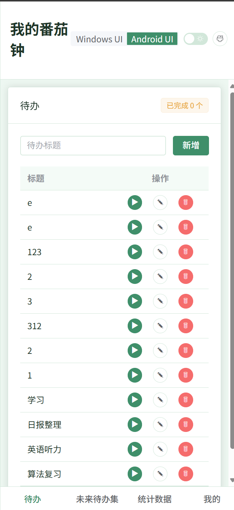
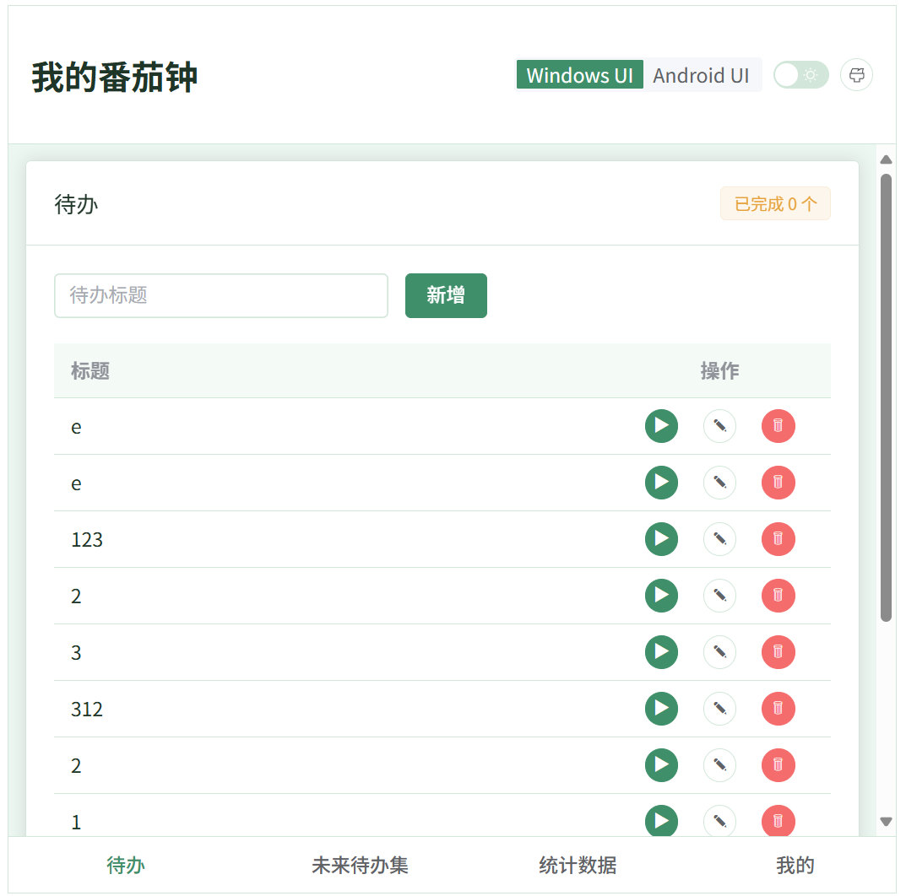

 # PomodoroTable

 一个致力于 Windows 和 Android 体验的番茄钟 MVP，前端基于 Vue 3 + Element Plus，后端由 FastAPI 提供 REST 接口，后续会加入 Agent 模块，能够根据番茄钟持续时间和习惯给出智能建议。

 ## 亮点一览
 - Windows 风格优先，带有桌面式导航和全局提示。
 - 多视图支持：任务列表、统计面板、个人配置和锁屏模式无缝切换。
 - 后端轻量：FastAPI + Pydantic 的结构让接口既清晰又便于扩展。

 ## 界面预览
 | 平台 | 预览 |
 | --- | --- |
 | 安卓 |  |
 | Windows |  |
 

 ## 快速启动（Windows）
 下面的顺序可以直接复制到 PowerShell 或 CMD；所有命令均假定当前目录是仓库根目录。

 ### 1）后端
 ```bash
 cd backend
 conda create -n pomodoro-table python=3.11 -y
 conda activate pomodoro-table
 pip install -r requirements.txt
 uvicorn main:app --reload --host 127.0.0.1 --port 8000
 ```
 状态检查：`http://127.0.0.1:8000/docs` 可以看到 FastAPI 自动生成的接口文档。

 ### 2）前端
 ```bash
 cd frontend
 npm install
 npm run dev
 ```
 访问提示：默认会在 `http://127.0.0.1:5173` 启动，端口冲突时 Vite 会自动切换并在终端输出新的地址。

## Windows 打包与安装使用
### 1）执行打包
在项目根目录打开 PowerShell：

```bash
cd frontend
npm install
npm run desktop:build
```

若你在公司/校园网络需要代理，可先执行：

```powershell
$env:HTTP_PROXY="http://127.0.0.1:7890"
$env:HTTPS_PROXY="http://127.0.0.1:7890"
$env:ELECTRON_GET_USE_PROXY="true"
$env:ELECTRON_MIRROR="https://npmmirror.com/mirrors/electron/"
npm run desktop:build
```

打包产物位置：`frontend/release/PomodoroTable-Setup-0.1.0.exe`。

图标资源位置：
- 安装包/桌面图标：`frontend/build/icon.ico`
- 网页与桌面窗口图标：`frontend/public/favicon.ico`
- 高分辨率图标源：`frontend/public/icon-256.png`

### 2）安装并启动
1. 双击 `PomodoroTable-Setup-0.1.0.exe`，按向导安装。
2. 首次启动前，先在 `backend` 目录运行 FastAPI 服务。
3. 启动桌面应用后，程序会访问本机 `http://127.0.0.1:8000`。

### 3）给其他 Windows 机器使用
1. 将安装包复制到目标机器。
2. 目标机器先安装并启动后端服务（或改为可访问的云端 API 地址）。
3. 再安装桌面客户端即可正常使用。

### 4）替换为你们自己的品牌图标
1. 准备一个 256x256（或更高）的方形 PNG。
2. 覆盖 `frontend/public/icon-256.png`，并重新生成 `frontend/build/icon.ico` 与 `frontend/public/favicon.ico`。
3. 重新执行 `npm run desktop:build`，新的安装包会带上新图标。

 ## Git 工作流 & 提交规范
 本项目沿用轻量化流程，推荐每次只实现一个“小功能”或一个 bug 修复再提交。

 1. 基于当前主线创建新分支：
 ```bash
 git checkout -b feature/<module>-<summary>
 ```
 2. 变更检查与暂存：
 ```bash
 git status
 git add -p     # 分块暂存便于形成清晰提交
 ```
 3. 编写规范提交信息（参考 Conventional Commits）：
 ```bash
 git commit -m "feat(frontend): add focus-lock transition"
 ```
 其中 `scope` 对应子系统/页面（如 `backend`, `api`, `frontend`）；可选的 `body` 针对细节说明。遇到文档或启动脚本调整，可改为 `docs:`, `chore:`, `fix:` 等类型。

 4. 提交后推送并发起 PR：
 ```bash
 git push -u origin feature/<module>-<summary>
 ```
 5. 若需要临时保存进度，可使用弱同步的 `git add -u` + `git stash`。

 更多 Git 规范与 PR 模板请参考 `docs/04-Git规范流程.md`。

 ## 参考文档
 - `docs/01-需求说明.md`
 - `docs/02-技术方案与架构.md`
 - `docs/03-API设计.md`
 - `docs/04-Git规范流程.md`
 - `docs/05-开发与启动指南.md`

